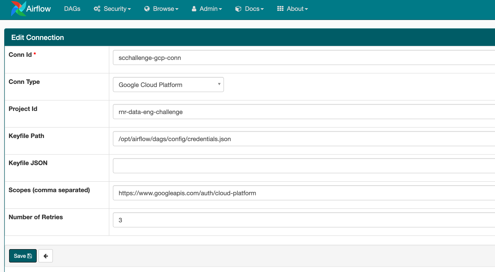

# Weekly Royalty

This repository contains my solution to a royalty reporting challenge. The goal was to connect tables that collect daily song plays to correct rightsholders and construct a weekly summary.

The project is implemented using **Python** and **Airflow** and can be spun up with a simple **docker-compose** command. In the following documentation I outline both the pipeline I built to solve the problem as well as the necessary steps to get up and running yourself.

One comment on the project architecture. Considering the size of the project the airflow setup comes with significant overhead. I still decided for the approach both to allow for convenient monitoring and the possibility to scale at a later stage. The current version runs locally using the LocalExecutor. For production this could be moved to a more suitable environment such as *google cloud compose*.

### What happens

The pipeline follows a number of sequential steps that can be easily expanded, for example to include more tests. The steps are listed below.

1. The pipeline checks that the payout table *payout_yyyymmdd* for the relevant week exists. It does so using a **BigQueryTableSensor** that ships with Airflow. The table validation can easily be expanded to other tables. If the table is detected we move on to the second step.

2. The second steps collects the relevant daily *listen_\** tables  to reduce resource consumption in the next phase.

  Output Table :arrow_forward:  **weekly_plays_yyyymmdd**

3. The third stage matches the track_id from *weekly_plays_yyyymmdd* to a valid rightsholder_id from *track_rightsholder_rollup*.

  Output Table :arrow_forward:  **weekly_plays_rightsholder_yyyymmdd**

4. The fourth steps adds a track_title to the previous result using *track_information_rollup*. Seeing that the track_title is rather decorative and is not mentioned as a unique identifier in the final reporting table in the task sheet I simply assign the first track_title that appears within the week for any given track_id.

  Output Table :arrow_forward:  **weekly_plays_title_rightsholder_yyyymmdd**

5. The fifth step collects the total number of plays for a given rigthsholder id within a given week using *weekly_plays_rightsholder_yyyymmdd* and *payout_yyyymmdd*. From that it computes the unit price for each rightsholder id. This does not allow for a single rightsholder to have multiple unit prices across different tracks. I comment on this below.

  Output Table :arrow_forward:  **weekly_rightsholder_payout_yyyymmdd**

6. The last stage merges the unit price from *weekly_rightsholder_payout_yyyymmdd* on to *weekly_track_title_rightsholder_yyyymmdd* and does some renaming to produce the final reporting tool as described in the task sheet.

  :checkered_flag::checkered_flag::checkered_flag:

  Output Table :arrow_forward:  **weekly_reporting_yyyymmdd**

**Further information**:

* Weeks run from **Monday** to **Sunday**
* The script is run automatically every day at **midnight**
* No matter which day of the week it is the script recognises the running week which it identifies by the date of the first day of the week. This allows for reports to be produced before the week is completed.
* When the script is first started it runs the pipeline for every week going back to a provided start date.

## Get up and running

The project is built using docker to allow convenient porting to different machines and potential future scaling. As a scheduling tool I have decided for airflow which allows to monitor the pipeline and comes with a number of useful out-of-the-box tools to interact with Google's BigQuery system. In the following I describe the necessary steps to start the pipeline in a local enviroment.

1. Make sure you have [docker](https://docs.docker.com/engine/install/) and [docker-compose](https://docs.docker.com/compose/install/) installed on your system.

2. Ensure that you have the necessary information and files to connect airflow and your google environment. To start the pipeline you need the following items.

  * project id: **rnr-data-eng-challenge**
  * input dataset: **challenge_dataset**
  * output dataset: **inr006**
  * keyfile: You need a json **credential key** that is connected to a service account that is linked to the project and has read permissions for the input dataset and write permissions to the output dataset. Place this key in the following locaction within the repository (possible once you have cloned into the repository): `/dags/config/credentials.json`

2. Using ssh, clone repo to local enviroment

  `git clone git@github.com:***/royalty_reporting.git`

3. Navigate to repo directory and place your key file in the appropriate location.

  `cd royalty_reporting && mv [path/keyfile.json] dags/config/credentials.json`

4. Now you can start up the docker compose file

  `docker-compose up`

4. Go to Airflow WebUI which is now running at [localhost](http://localhost:8080/admin/). You may have to log in. The required admin account will be have been created at startup.

5. Add google connection to connections

  a. Go to connections input form

  

  

  b. Fill out input form with corresponding details and save

  

6. Now you can start the airflow pipeline by turning on the dag. The pipeline should now be running. Seeing that the start date lies in the past the pipeline will be busy initially catching up to today's date.

  

## Adapt Pipeline

In case you wish to adapt the pipeline you can change the settings in the file `dags/config/settings.py`. Here you can change the timeframe for running the pipeline, the scheduled interval or the address of output or input datasets.

## Comments on the data

While setting up the reporting tool I came across some small questions. I outline here how I dealt with them.

* **multiple tracks on a rightsholder id**

  It was not entirely clear to me how to handle cases where a single rightsholder_id matches on multiple songs within a given week. The payout table does not differentiate by track_id for a rightsholder_id. In my solution I therefor assume that for a given rightsholder_id the unit_price is identical for all tracks within a week.

* **multiple track_title on a track id**

  From the datasheet it seems possible that there can be multiple track_id, track_title and rightsholder_id combinations within a single reporting week. The final output table described in the task however only points to unique track_id and rightsholder_id combinations. The code therefor simply picks the first track_title for a given track_id within a week.

## Troubleshooting

* Issue with permissions

  If `docker-compose` gives you a permission error you need to adjust permissions for relevant subdirectories.

  `chmod -R 755 logs`
  `chmod -R 755 scripts`
