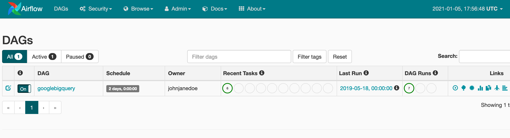

# Weekly Royalty

The project is implemented using **python** and **airflow** and can be spun up with a simple docker-compose command.

As I did not have the required access to the google bigquery table the following is done assuming and inferring data formats from the task sheet.

To run and test the pipeline I have created a small number of mock up tables in my bigquery environment. The data goes back to the week starting on 2020-12-21. This is also when the airflow scheduler will start running.

The dataset and tables are currently connected to my account. Please contact me for me to give access if needed.

## Get up and running

1. Make sure you have [docker](https://docs.docker.com/engine/install/) and [docker-compose](https://docs.docker.com/compose/install/) installed on your system.

2. You need to setup your google environment. The details go beyond the scope here but generally the steps are.

  * create a google cloud project
  * enable the bigquery API for the project
  * create a service account for the project
  * create and download a key for the service account
  * rename and move the key to `/dags/config/credentials.json`

2. Using ssh, clone repo to local enviroment

  `git clone git@github.com:wbglaeser/royalty_reporting.git`

3. Navigate to repo directory and start up docker-compose

  `docker-compose up`

4. Go to Airflow WebUI which is now running at [localhost](http://localhost:8080/admin/).

5. Add google connection to connections

  a. Go to connections input form

  

  

  b. Fill out input form with corresponding details and save

  

6. Now you can start the airflow pipeline. It will start pulling data from the first week for which I have create mock data. The scheduler should now run the pipeline from up until today on a daily basis.

## Comments on the data

While setting up the reporting tool I came across some small questions. I outline here how I dealt with them.

* **multiple tracks on a rightsholder id**

  It was not entirely clear to me how to handle cases where a single rightsholder_id matches on multiple songs within a given week. The payout table does not differentiate by track_id for a rightsholder_id. In my solution I therefor assume that for given rightsholder_id the unit_price is identical for all tracks within a week.

* **multiple track_title on a track id**

  From the datasheet it seems possible that there can be multiple track_id, track_title and rightsholder_id combinations within a single reporting week. The final output table described in the task however only points to unique track_id and rightsholder_id combinations. The code therefor simply picks the first track_title for a given track_id within a week.

## Troubleshooting

* Issue with permissions

  If `docker-compose` gives you a permission error you need to adjust permissions for relevant subdirectories.

  `chmod -R 755 logs`
  `chmod -R 755 scripts`
